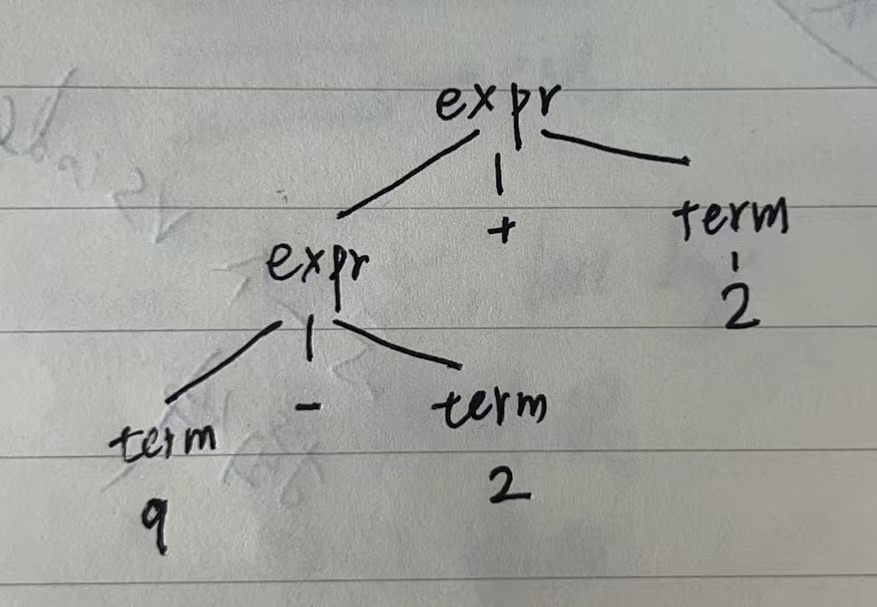
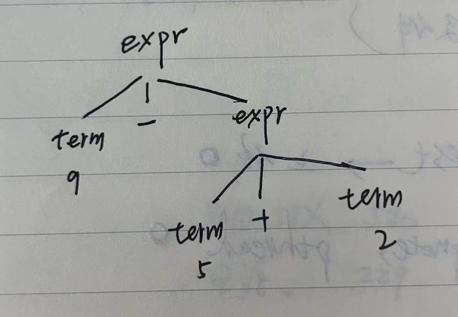

# Dragon Book
这是一本非常有意思的书。非常清晰的概念、技巧，和scheme的方法异曲同工。

Purple book, < Compilers: Principles, Techniques and Tools >

## 答案:

https://github.com/fool2fish/dragon-book-exercise-answers 

# chap 2 A simple Syntax-Directed Translator
句法指引的翻译器

Context-free grammars or BNF(Backus-Naur Form)

infix expressions to postfix form,(操作符在操作数之后)

context-free grammar, 语法,

## 2.2 Syntax Definition
$$
stmt \to \textbf{if} (expr) \text{stmt}  \space \textbf{else} \space stmt
$$
$\to$ 被称为"can have the form", 可以有形式,叫做production,
有些符号是terminals, 结束符, if,parentheses
有些符号是nonterminals, 非结束符，比如变量expr, 和stmt,

### 2.2.1 语法的定义
**四则运算的语法，productions,产生式**
$$
\begin{aligned}
expr  \to & expr + term \\
       & | expr - term \\
       & | term \\
\\
term \to & term * factor \\
        & | term / factor \\
        & | factor \\
\\
factor \to & digit | (expr) \\
\end{aligned}
$$

### 习题 2.2.1


### 2.2.5 习题

### 2.2.6 Construct a context-free grammar for roman numerals
什么是罗马数字呢?

```shell
# 1,2,3 | 4 | 5,6,7,8 | 9
I, II, III | IV | V, VI, VII, VIII | IX
# 10
X
# 50
L
# 100
C
# 500
D
# 1000
M


digit -> smallDigit | IV | V smallDigit | IX
smallDigit -> I | II | III | ε

# map roman numerals to arabic numberals
XII => X, II=> 10 + 2 => 12
CXCIX => C, XC, IX => 100 + 90 + 9 => 199
MDCCCLXXX => M, DCCC, LXXX => 1000 + 800 + 80 = 1880

```

根据上面的两条规则，我们得到罗马数字(千以内)的生成语法:

```shell
romanNum -> thousand hundred ten digit
thousand -> M | MM | MMM | ε
hundred  -> smallHundred | C D | D smallHundred | C M
smallHundred  -> C | CC | CCC | ε
ten      -> smallTen | X L | L smallTen | X C
smallTen -> X | XX | XXX | ε
digit    -> smallDigit | I V | V smallDigit | I X
smallDigit ->  I | II | III | ε

```
### 2.3.3 简单句法指导的翻译
#### 名词解释:

```shell
syntax - 句法
syntax-directed definitions, 句法指导的定义
production - ?如何翻译, 一种rewrite规则，符号替换，递归地进行符号替换直到生成新的符号。
    推导。推导头，推导体。->号左边的是推导头，右边的是推导体。 
semantic - 语义
infix   - 操作符在中间
prefix  - 操作符在前面
postfix - 操作符在后面

```


**简单**，什么叫做简单? 看一个例子

| Production      | 语义规则 |
| ----------- | ----------- |
| ```expr -> expr1 + term```       | ```expr.t = expr1.t || term.t || '+'  ```   |


在每一个production推导头，发生的nonterminal非结束符号的字符形式转换，是推导体的非结束符号的转换的级联，顺序保持推导里描述的顺序, 穿插着一些可选的附加字符串。 具有这种性质的句法引导定义，被称为简单的。

这里expr.t, expr的转换就是expr1, term的字符转换的顺序级联，最后在后面补上'+'符。

讨论translation scheme, 翻译方案，简单句法引导定义，的实现, 只打印additioanl strings, 附加字符串, 按照定义时出现的顺序。

### 2.3.4 Tree Traversals, 树的遍历
在描述属性 判别，估计， code fragement代码块的执行， 翻译方案中, 需要使用树遍历技术。树的遍历从根部开始，按照某种顺序，访问树上的所有节点。

depth-first traversal, 深度优先遍历, 尽可能先去访问节点的未被访问的子节点, 可以以最快的速度访问到距离根节点最远的子节点。

伪代码为:
```C
procedure visit(node N){
    for (each child C of N, from left to right){
        visit(C)
    }
    evaluate semantic rules at node N;
}
```
这里先访问左边的节点，再访问右边的节点。访问子节点后，再评估本节点的属性的语义规则。或者执行本节点的程序块。

preorder, postorder遍历, 访问子节点前先执行节点的评估，或执行完节点的评估再去访问子节点。进入节点后，离开节点前。

### 2.3.5 Translation Scheme, 翻译方案

program fragments,在推导体内的程序块，称为semantic actions, 语义动作, 表示方式如:

$rest -> + \space term \space  \{print('+')\} \space rest1$

* property evaluation, 属性转义
* semantic action, 语义动作


### 2.3.6 作业
#### 作业2.3.1
设计一个syntax-directed translation scheme, translates arithmetic expression from infix notation into prefix notation. 

productions, 推导:

``` shell
# from left to right
expr -> expr + term | expr - term | term
term -> term * factor | term / factor | factor
factor -> digit | (expr)

```

translation scheme, 翻译方案, 通过遍历树的方式，实现符号的转换

```shell
expr -> {print("+")} expr + term |
        {print("-")} expr - term |
        term
term -> {print("*")} term * factor |
        {print("/")} term / factor |
        factor
factor-> {print(digit)} digit |
        (expr)
```


give annotated parse trees for inputs 9-5+2 and 9-5*2





#### 作业2.3.2
construct a syntax-directed translation scheme , translate arithmetic expression from postfix notation into infix notation. 

这里是算术表达式，所以没有2.3.1那么复杂

productions, 推导: 
```shell
expr ->   expr expr +  
        | expr expr -  
        | expr expr *
        | expr expr /
        | digit

```

translation schemes:
```shell
expr -> expr {print("+")} expr +
        | expr {print("-")} expr -
        | {print("(")} expr {print(")*(")} expr {print(")")} *
        | {print("(")} expr {print(")/(")} expr {print(")")} /
        | digit {print(digit)}

```

Give annotated parse trees for the inputs $95-2*$ and $952*-$


#### 作业2.3.3
construct a syntax-directed translation scheme that translates integers into roman numbers

```shell
#  repeat('a',2) = 'aa'
repeat(sign, times)

# translation schemes,
num    -> thousand hundred ten digit
        { num.roman=thousand.roman || hundred.roman || ten.roman || digit.roman;
            print(num.roman); }
thousand -> low {thousand.roman = repeat('M', low.v)}
hundred  -> low {hundred.roman = repeat('C', low.v)}
        | 4 {hundred.roman = 'CD'}
        | high {hundred.roman = 'D' || repeat('X', high.v - 5)}
        | 9 {hundred.roman = 'CM'}
ten    -> low {ten.roman = repeat('X', low.v)}
        | 4 { ten.roman = 'XL'}
        | high {hundred.roman =  'L' || repeat('X', hight.v - 5)}
        | 9 {ten.roman = 'XC'}
digit  -> low {digit.roman = repeat('I', low.v)}
        | 4 {digit.roman = 'IV' }
        | high {digit.roman = 'V' || repeat('I', hight.v - 5)}
        | 9 {digit.roman = 'IX'}
low    -> 0 {low.v = 0}
        | 1 {low.v = 1}
        | 2 {low.v = 2}
        | 3 {low.v = 3}
high   -> 5 {high.v = 5}
        | 6 {high.v = 6}
        | 7 {high.v = 7}
        | 8 {high.v = 8}

```

#### 作业2.3.4
construct a syntax-directed translated scheme that translates roman numerals into integers

```shell
romanNum  -> thousand hundred ten digit
thousand  -> M | MM | MMM | ε
hundred   -> smallHundred | C D | D smallHundred | C M
smallHundred -> C | CC | CCC | ε
ten       -> smallTen | X L | L smallTen | X C
smallTen  -> X | XX | XXX | ε
digit     -> smallDigit | IV | V smallDigit | IX
smallDigit -> I | II | III | ε
```

translation schemes:
```shell
romanNum   -> thousand hundred ten digit {romanNum.v=thousand.v || hundred.v || ten.v || digit.v ; print(romanNum.v)}
thousand   -> M {thousand.v = 1}
            | MM {thousand.v = 2}
            | MMM {thousand.v = 3}
            | ε {thousand.v = 0}
hundred    -> smallHundred {hundred.v=smallHundred.v}
            | C D {hundred.v=smallHundred.v}
            | D smallHundred {hundred.v = 5 + smallHundred.v}
            | C M {hundred.v = 9}
smallHundred -> C {smallHundred.v = 1}
            | CC {smallHundred.v = 2}
            | CCC {smallHundred.v = 3}
            | ε {hundred.v = 0}
ten        -> smallTen {ten.v = smallTen.v}
            | X L { ten.v = 4}
            | L smallTen { ten.v=5 + smallTen.v}
            | X C {ten.v = 9}
smallTen   -> X {smallTen.v=1}
            | XX {smallTen.v = 2}
            | XXX {smallTen.v = 3}
            | ε {smallTen.v = 0}
digit      -> smallDigit {digit.v = smallDigit.v}
            | I V {digit.v = 4}
            | V smallDigit {digit.v = 5 + smallDigit.v}
            | I X {digit.v = 9}
smallDigit -> I {smallDigit.v = 1}
            | II {smallDigit.v = 2}
            | III {smallDigit.v = 3}
            | ε {smallDigit.v = 0}
```


#### 作业2.3.5
construct a syntax-directed translation scheme, translates postfix arithmetic expressions into equivalent infix arithmetic expressions.

productions:
```shell
expr  -> expr expr op | digit


```

translation scheme:
```shell
expr  -> {print(op)} expr expr | digit {print(digit)}

```

## 2.4 Parsing
The process of determining how a string of terminals can be generated by a grammar. 确定一串字符串是如何被语法产生的过程。A Parser must be capable of constructing the tree in pricinple, or else the translation can not be guaranteed correct.

### 2.4.1 Top Down Parsing
top down construction of a parse tree

```
1. At node N, labeled with nonterminal A, select one of the productions for A and construct children at N for the symbols in the production body
2. Find the next node at which a subtree is to be constructed, typically the leftmost unexpanded nonterminal of the tree


```
lookahead symbol,当前正在 扫描的terminal in the input, lookahead符号 是第一个，最左边的，输入字符串的terminal。 


### Exercise 2.4.1 
Construct recursive-descent parsers, starting with the following grammars

$$ 
a)\space  \text{S} \to \quad \text{+} \space \text{S} \space \text{S} \mid - \text{S} \space \text{S} \mid a \hspace{50cm} \\
b) \space \text{S} \to \quad \text{S} \space ( \space  \text{S} \space ) \space \text{S} \mid \epsilon \hspace{50cm} \\
c) \space \text{S} \to \quad 0 \space \text{S} \space 1 \mid 0 \space 1 \hspace{50cm} \\
$$
o3.
添加一个简单的Makefile文件，对一些例子进行方便的编译. 发现使用CMake还是比用Make要方便很多。

### 2.4.3 When to use $\epsilon \text{-Production}$ 
$\epsilon$ production is to do nothing

$$

optexpr \to expr | \epsilon
$$


### 2.4.4 Designing a Predictive Parser
我们可以将Section 2.4.2部分引入的技术，通用化，使之适合一般情况, 符合任意的语法，disjoint FIRST sets, 不想连的First集合, production bodies, 推导, 属于任意nonterminal的推导。

我们也可以看到，当我们有一个translation scheme, 翻译方案$-$时, 拥有嵌入action的语法，$-$此时可以执行这些action,作为parser的视线的一部分过程。

回忆，我们曾经说过，预测型分析器, $predictive \space parser$,为每一个nonterminal, 非终止符号，都包含一个可运行的过程函数。非终止符号A的执行过程做2件事情:

1. 执行过程判断使用哪一个$A$-production，通过检查lookahead symbol,预测符号。如果预测符号在$FIRST(\alpha)$内的话， 就选择带有body $\alpha$ 的production, 推导。如果对预测符号，存在两个非空的body,主体，的话, 我们就无法使用这种解析方法，预测型分析。所以我们这里能够使用得，只能是一个预测符号对应一个推导主体。另外，A的$\epsilon$-推导,如果存在的话，在预测符号并不存在任何的FIRST集合的话，A的推导主体。$\epsilon$-推导将被使用。
2. 然后执行过程会模仿选择的推导主体。主体的符号将从左到右，依次执行。Nonterminal会执行Nonterminal的执行过程, 与预测符号匹配的terminal,终止符号将读取下一个输入符号。如果主体的终止符号在某一中间过程中不匹配预测符号的话，将触发一个句法错误，syntax error。

正如扩展语法时使用translation scheme, 翻译方案, 句法directed translator可以通过扩展预测型解析器。

下述的有限的操作就可以满足要求:
1. 构造一个预测型解析器，忽略推导中的行为，actions,
2. 将translation scheme,翻译方案中的行为拷贝到解析器中, 如果一个action出现在推导$p$的语法符号$X$后的话，action拷贝到$p$的代码的$X$的实现之后。如果action出现在推导之前的话，action拷贝到推导主体的代码之前。

我们将会在Section 2.5部分构造这样的转换器。

### 2.4.5 Left Recursion,左递归
我们可以构造一个递归下降的解析器，永远向下执行下去。左递归推导会产生一个问题:

$$
expr \to expr + term
$$
在上式中, 主体的最左符号和推导的头部的非终止符号相等。
一直循环下去，直到a terminal is matched. 

Consider a nonterminal $A$ with 2 productions
$$
A \to A\alpha | \beta \\
$$
$\alpha$ 和 $\beta$ 是sequences of terminals and nonterminals that do not start with $A$. 例如:
$$
expr \to expr + term | term \\
$$
nonterminal $A=expr$, string $\alpha = + term$, and string $\beta=term$

nonterminal $A$ 和它的 production 为left recursive的, 左递归的。反复执行的话，会在$A$的右边产生一系列的$\alpah$. 当最终$A$被$\beta$所代替时，我们得到一组$\alpha$, 前面是一个$\beta$值。
可以改写为
$$
A \to \beta R \\
R \to \alpha R | \epsilon \\
$$
$R$是右递归的， right recursive, has $R$ itself as the last symbol on the right side. 

### 2.4.6 作业
Exercise 2.4.1: Construct recursive-descent parsers, starting with the following grammars: 语法:

a) $S \to +SS | -SS|a$

b) $S \to S(S)S | \epsilon$

c) $S \to 0 S 1 | 0 1$
